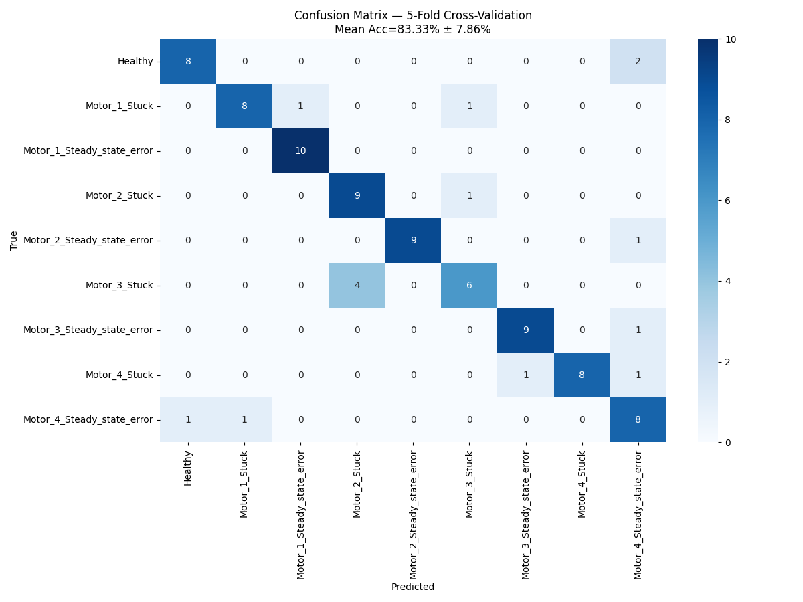

# Digital Twin for Fault Diagnosis

> Ce projet vise à entraîner un modèle d'IA pour détecter des pannes sur un robot à 4 moteurs. Le modèle est entraîné sur un large jeu de données simulé et utilisé sur des données réelles. L'écart entre les deux distributions entraîne une baisse des performances des modèles précédents.

# La Problématique

> L'objectif principal du projet est d'augmenter la précision du modèle sur les données réelles.

## ✨ Travaux réalisés

> Augmentation du volume de données d'entraînement
> Ajout de bruit pour rapprocher la distribution des données simulées.
> Première version du transfer learning
> Une version améliorée du transfer learning avec validation croisée

## 🚀 Installation

### Prérequis

- Matlab
- Accès à La Ruche

## Lancer un environnement sur La Ruche

```bash
module load anaconda3/2023.09-0/none-none
conda create -n my_env
source activate my_env
```

### Installer les dépendances

```bash
pip install -r requirements.txt
```

### Cloner le dépôt

```bash
git clone https://github.com/Alec129/Pole-projet/
cd Pole-projet
```

### Lancer le projet

Le dépôt inclut un script de soumission pour exécuter le job de validation croisée sur La Ruche.
Depuis la racine du dépôt sur La Ruche, soumettez le job avec :

- Première version du transfer learning

```bash
sbatch Transfer-learning/lancer-calcul.sh
```

Pour visualiser les résultats de l'entraînement, ouvrez les fichiers `confusion_matric_real_rf.png` et `confusion_matric_rf.png`.

- Dernière version du transfer learning avec validation croisée

```bash
sbatch scripts/submit_cv5.sh
```

Des exemples de checkpoints entraînés se trouvent dans `scripts/` (ex. `best_finetuned_cv.pt`, `best_pretrained_cv.pt`).

### Performances

- Le modèle de transfer learning atteint une précision de **83,33 % ± 7,86 %**.
- Matrice de confusion (validation croisée à 5 plis) :



### Description des dossiers

| Dossier/Fichier | Description |
|---|---|
|src/Training | Contient les codes de models pour comprendre comment construire un code d'IA (Random Forest et LSTM)|
| src/Transfer-learning | Tout le code pour exécuter la méthode de transfer learning |
| src/Transfer-learning/lancer-calcul.sh | Fichier pour lancer le calcul sur La Ruche |
| src/Transfer-learning/transfer-learning.py | Code de la méthode de transfer learning |
| src/Transfer-learning/models.py | Fichier du modèle CNN 1D et LSTM |
| src/mydataset | Contient toutes les données pour entraîner et tester le modèle |
| src/scripts | Contient les fichiers pour le modèle de transfer learning optimisé |
| src/dtr digital model simulink | Contient le notebook Matlab pour le modèle LSTM entraîné sur un jeu de données doublé |

---

## 🙏 Remerciements

- Laboratoire Génie Industriel de CentraleSupélec
